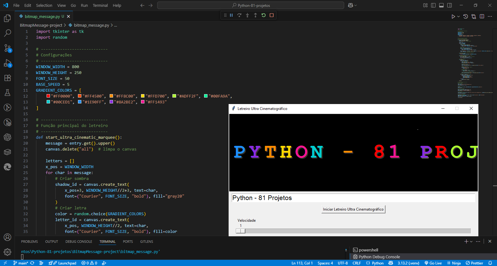

<h1 align="center">💡 Bitmap Message</h1>

<p align="center">
  <em>Um letreiro animado em Python com visual cinematográfico</em>
</p>

<p align="center">
  <a href="https://www.python.org/"></a>
  
  
</p>

---

## 🎬 Sobre o Projeto
**Bitmap Message** é um letreiro animado inspirado nos clássicos luminosos de Hollywood.  
Ele utiliza **Tkinter** para animar letras com **gradientes**, **sombras**, **fade in/out** e **piscar aleatório**, criando um efeito visual moderno e envolvente.

---

## ✨ Funcionalidades

| Recurso | Descrição |
|----------|-----------|
| 🎨 **Animação de texto** | Letras se movem horizontalmente criando um efeito de letreiro contínuo. |
| 🌈 **Gradiente dinâmico** | Transição suave de cores vibrantes. |
| 💡 **Fade in/out** | Aparição e desaparecimento suave das letras. |
| 🔦 **Efeito de piscar** | Piscar aleatório para dar vida ao letreiro. |
| ⚡ **Controle de velocidade** | Ajuste em tempo real com um slider intuitivo. |
| 🖊 **Mensagem customizável** | Digite qualquer frase para exibição imediata. |

---

<p align="center">
  
</p>

---

## 🚀 Como Usar

Abra o terminal ou prompt de comando.

Navegue até a pasta do projeto:

```bash
cd caminho/para/BitmapMessage-project

Execute o script Python:

python bitmap_message.py

Digite sua mensagem no campo de entrada.

Clique em Iniciar Letreiro Ultra Cinematográfico.

Ajuste a velocidade no slider, se desejar.

⚙️ Requisitos

Python 3.10 ou superior

Tkinter (já incluso no Python padrão)

Nenhuma biblioteca externa necessária.

🧠 Observações

Ótimo projeto para praticar animações com Tkinter.

Pode ser expandido para incluir:

✨ Efeitos de partículas

🔊 Sons sincronizados

🔁 Movimento circular

🌟 Modo tela cheia

👨‍💻 Autor

Criado com ❤️ em Python e Tkinter.
Inspirado no livro The Big Book of Small Python Projects, de Al Sweigart.

📄 Licença

Distribuído sob a licença MIT.
Sinta-se livre para usar, modificar e compartilhar para fins pessoais ou educacionais.