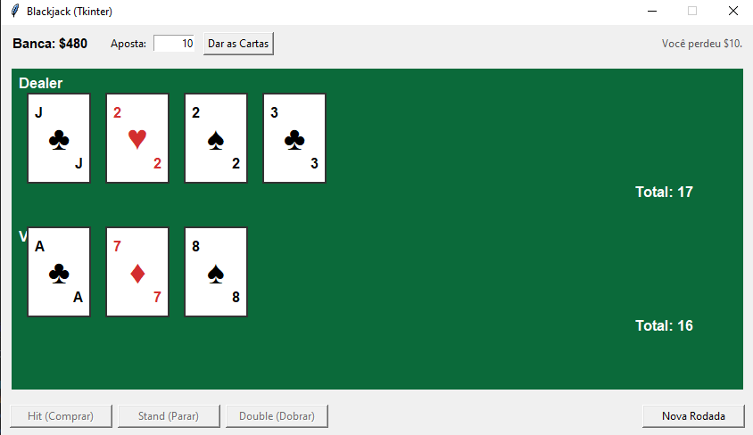
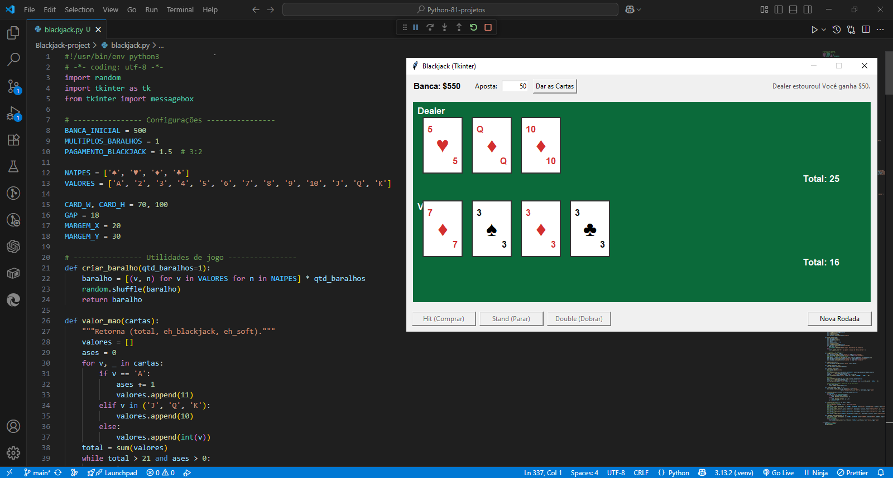

<h1 align="center">🃏 Blackjack com Tkinter</h1>

<p align="center">
  <em>Um Blackjack (21) simples e elegante em Python + Tkinter</em>
</p>

<p align="center">
  <a href="https://www.python.org/"></a>
  
  
</p>

<p align="center">
  Inspirado no livro <strong>The Big Book of Small Python Projects</strong> de <em>Al Sweigart</em> (Projeto 4 — Blackjack).
</p>

---

## 📸 Preview

<p align="center">
  
  
</p>

---

## 🧭 Sumário
- [Funcionalidades](#-funcionalidades)
- [Requisitos](#-requisitos)
- [Como Rodar](#-como-rodar)
- [Controles](#-controles)
- [Estrutura do Projeto](#-estrutura-do-projeto)
- [Configurações](#-configurações)
- [Roadmap](#-roadmap)
- [Licença](#-licença)

---

## 🎮 Funcionalidades

- ✅ Interface gráfica em **Tkinter**
- 💰 **Banca** inicial de **$500**
- 🎯 Apostas por rodada
- 🖤 **Blackjack natural paga 3:2**
- 🧠 Ás conta como **1 ou 11** automaticamente
- ✋ Ações: **Hit**, **Stand** e **Double** (nas 2 primeiras cartas e com saldo)
- 🏦 Dealer compra até **17** (**inclui soft 17**)
- 🔁 Baralho é reembaralhado quando necessário
- 🟰 Detecta **bust** e **push** (empate)

---

## 📦 Requisitos

- **Python 3.8+** (recomendado 3.10+)
- Nenhuma dependência externa — o **Tkinter** já vem com a instalação padrão do Python.

---

## ▶️ Como Rodar

```bash
# 1) clone o repositório
git clone https://github.com/<seu-usuario>/<seu-repo>.git
cd <seu-repo>

# 2) execute o jogo
python blackjack_tk.py

**Jogando:**

1. Digite o valor da **Aposta**  
2. Clique em **Dar as Cartas**  
3. Use **Hit**, **Stand** ou **Double**  
4. Clique em **Nova Rodada** para continuar

---

## ⌨️ Controles

| Ação                | Botão / Comando | Observações                                   |
|---------------------|-----------------|-----------------------------------------------|
| Comprar carta       | **Hit**         |                                               |
| Parar               | **Stand**       |                                               |
| Dobrar a aposta     | **Double**      | Só nas 2 primeiras cartas e com saldo         |
| Nova mão            | **Nova Rodada** | Após o fim de uma mão                         |

---

## 🗂️ Estrutura do Projeto

├── blackjack_tk.py # Jogo com interface Tkinter
├── blackjack.py # Versão em terminal (opcional)
├── tela-jogo.png # Screenshot 1
├── blackjack-imagem.png # Screenshot 2
├── LICENSE
└── README.md

---

## ⚙️ Configurações

Dentro do código (`blackjack_tk.py`), você pode alterar rapidamente:

```python
BANCA_INICIAL = 500        # valor inicial
MULTIPLOS_BARALHOS = 1     # 1, 4, 6, 8...
PAGAMENTO_BLACKJACK = 1.5  # 3:2

🗺️ Roadmap

🔜 Split de pares

🔜 Contagem básica de cartas

🔜 Múltiplos baralhos (4/6/8) com penetração configurável

🔜 Sons, animações e temas claros/escuros

🔜 Histórico de mãos e estatísticas

Sugeriu algo legal? Abra uma Issue ou envie um PR! 🎉

📄 Licença

Este projeto está licenciado sob a MIT License.
Sinta-se à vontade para usar para fins pessoais e educacionais.