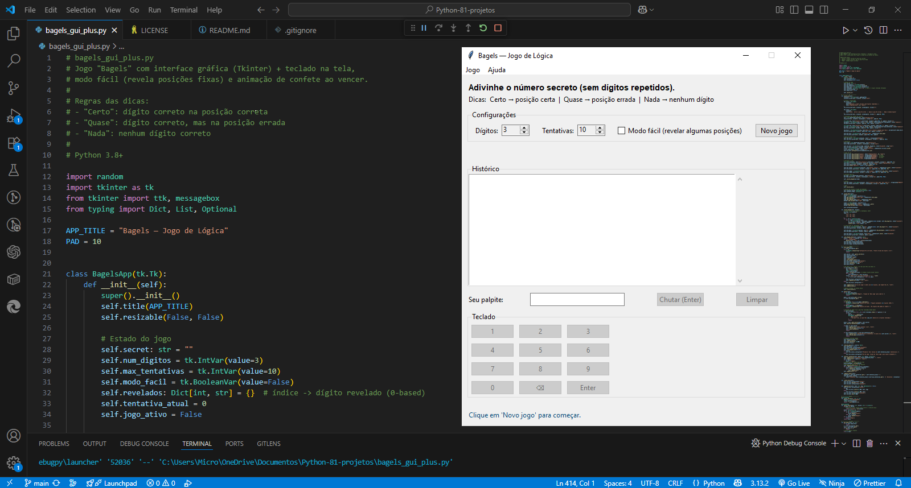

# Bagels GUI+ 🎲🎉
<p align="center">
  
</p>


Jogo de lógica **Bagels** com interface gráfica em **Tkinter**.  
Adivinhe o número secreto sem repetir dígitos, usando dicas visuais, teclado na tela, **modo fácil** e até **animação de confete** quando você vence.  

 <!-- opcional, se quiser adicionar -->

---

## 📌 Regras
- O jogo sorteia um número secreto **sem dígitos repetidos**.
- Você tem um número limitado de tentativas para acertar.
- As dicas:
  - **Certo** → dígito correto na posição correta  
  - **Quase** → dígito correto na posição errada  
  - **Nada** → nenhum dígito correto  

Modo fácil: revela algumas posições fixas logo no início.

---

## 🚀 Como rodar
Requisitos: **Python 3.8+** (Tkinter já vem incluído em Windows/macOS; no Linux pode precisar instalar `python3-tk`).

Clone o repositório e execute:

```bash
git clone https://github.com/SEU_USUARIO/bagels-gui-plus.git
cd bagels-gui-plus
python bagels_gui_plus.py

# Bagels GUI+ 🎲🎉

Jogo de lógica **Bagels** com interface gráfica em **Tkinter**.  
Adivinhe o número secreto sem repetir dígitos, usando dicas visuais, teclado na tela, **modo fácil** e até **animação de confete** quando você vence.  

 <!-- opcional, se quiser adicionar -->

---

## 📌 Regras
- O jogo sorteia um número secreto **sem dígitos repetidos**.
- Você tem um número limitado de tentativas para acertar.
- As dicas:
  - **Certo** → dígito correto na posição correta  
  - **Quase** → dígito correto na posição errada  
  - **Nada** → nenhum dígito correto  

Modo fácil: revela algumas posições fixas logo no início.

---

## 🚀 Como rodar
Requisitos: **Python 3.8+** (Tkinter já vem incluído em Windows/macOS; no Linux pode precisar instalar `python3-tk`).

Clone o repositório e execute:

```bash
git clone https://https://github.com/BrunoMateus8817/bagels-gui-plus
cd bagels-gui-plus
python bagels_gui_plus.py
