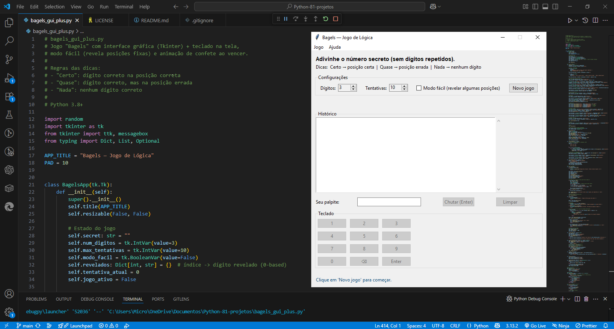

<h1 align="center">🥯 Bagels GUI+</h1>

<p align="center">
  <em>Um jogo de lógica numérica com interface gráfica em Python</em>
</p>

<p align="center">
  <a href="https://www.python.org/"></a>
  
  
</p>

---

## 📝 Sobre o Jogo

**Bagels** é um jogo clássico de adivinhação numérica.  
Você precisa descobrir um **número secreto** com dígitos **únicos** em um número limitado de tentativas.

### 🔍 Como funciona
- O programa gera um número secreto com **dígitos únicos**.  
- Você faz palpites tentando adivinhar.  
- Após cada tentativa, o jogo dá dicas:
  - **Certo** 🟢: dígito correto **na posição correta**.  
  - **Quase** 🟡: dígito correto, mas **na posição errada**.  
  - **Nada** 🔴: nenhum dígito está correto.  

---

## 🎨 Recursos da versão GUI+
- Interface gráfica interativa com **Tkinter**.  
- **Teclado na tela** para facilitar os palpites.  
- **Modo fácil**: revela algumas posições corretas para iniciantes.  
- **Animação de confete** 🎉 quando você acerta o número secreto.  

---

## 🖼️ Prévia

<p align="center">
  
</p>

---

## 🚀 Como Executar

### **Pré-requisitos**
- Python **3.8+** instalado.  
- Nenhuma biblioteca externa necessária (Tkinter já incluso no Python padrão).

---

### **Passo a passo**
1. Clone este repositório:
   ```bash
   git clone https://github.com/BrunoMateus8817/the-big-book-projects.git

Navegue até a pasta do projeto:

cd the-big-book-projects/bagels-project

Execute o script:

python bagels_gui.py

🛠 Tecnologias

Python 3.8+

Tkinter para a interface gráfica

📚 Referência

Baseado no livro:
The Big Book of Small Python Projects
Autor: Al Sweigart
Link para o livro

📄 Licença

Distribuído sob a licença MIT.
Sinta-se livre para usar, modificar e compartilhar para fins pessoais ou educacionais.
