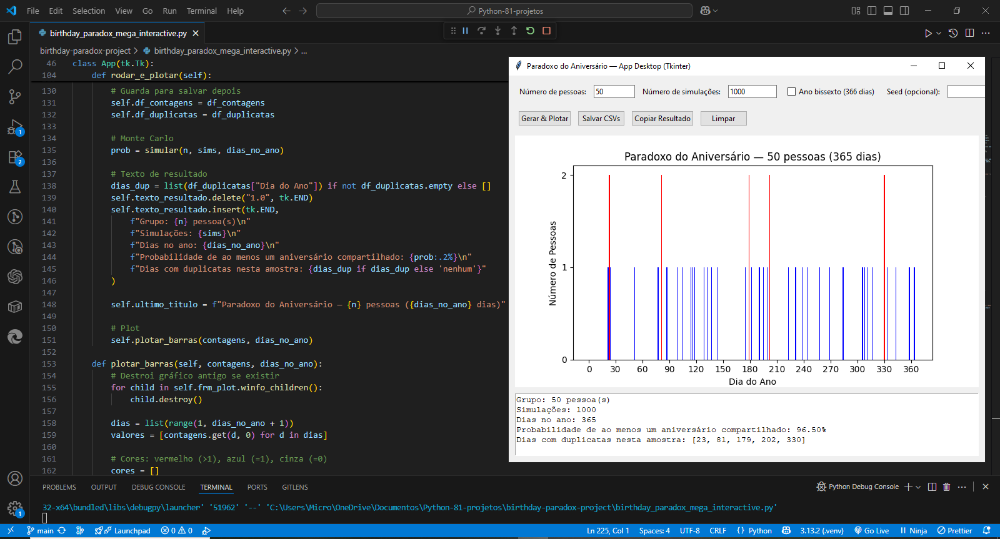

<h1 align="center">🎂 Birthday Paradox Interactive</h1>

<p align="center">
  <em>Uma aplicação em Python para explorar o famoso Paradoxo do Aniversário com uma interface gráfica interativa.</em>
</p>

<p align="center">
  <a href="https://www.python.org/"></a>
  
  
  
</p>

---

## 📖 Sobre o Paradoxo do Aniversário

O **Paradoxo do Aniversário** é um problema de probabilidade que demonstra que, em um grupo relativamente pequeno de pessoas, é surpreendentemente provável que **duas compartilhem a mesma data de aniversário**.

**Exemplos:**
- Em um grupo de **23 pessoas**, a chance é de aproximadamente **50%**.
- Em um grupo de **50 pessoas**, a probabilidade ultrapassa **96%**.

---

## ✨ Funcionalidades

- Interface gráfica intuitiva desenvolvida com **Tkinter**.  
- **Entradas personalizáveis**:
  - Número de pessoas no grupo.
  - Quantidade de simulações.
  - Inclusão de anos bissextos (366 dias).
  - Semente aleatória para reprodutibilidade.
- **Visualização gráfica** com:
  - **Vermelho** → Datas repetidas.
  - **Azul** → Datas únicas.
- **Exportação para CSV** com resultados detalhados.
- **Copiar resultados** diretamente da interface.
- Probabilidades calculadas de forma precisa e rápida.

---

## 🖼️ Prévia

<p align="center">
  
</p>

---

## 🚀 Como Executar

### **Pré-requisitos**

- **Python 3.8+**  
- Bibliotecas necessárias:
  ```bash
  pip install matplotlib pandas

Passo a passo

Clone este repositório:
git clone https://github.com/BrunoMateus8817/the-big-book-projects.git

Acesse a pasta do projeto:
cd the-big-book-projects/birthday-paradox-project

Execute o script:
python birthday_paradox_gui.py

🛠 Tecnologias

Python 3.8+

Tkinter — Interface gráfica

Matplotlib — Visualização gráfica

Pandas — Manipulação e exportação de dados

📚 Referência

Projeto baseado no livro:
The Big Book of Small Python Projects
Autor: Al Sweigart
🔗 Acesse o livro

📄 Licença

Distribuído sob a licença MIT.
Sinta-se à vontade para usar, modificar e compartilhar para fins pessoais ou educacionais.
